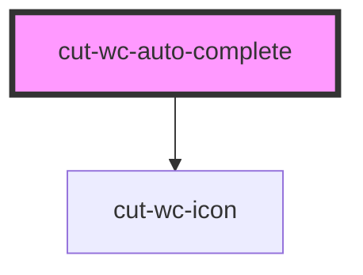

# cut-wc-auto-complete

<!-- Auto Generated Below -->

## Properties

| Property       | Attribute   | Description | Type                        | Default                 |
| -------------- | ----------- | ----------- | --------------------------- | ----------------------- |
| `disabled`     | `disabled`  |             | `boolean`                   | `false`                 |
| `dropDownData` | --          |             | `SelectDropDownDataModal[]` | `null`                  |
| `error`        | `error`     |             | `boolean`                   | `undefined`             |
| `guideline`    | `guideline` |             | `string`                    | `undefined`             |
| `icon`         | `icon`      |             | `boolean`                   | `true`                  |
| `iconName`     | `icon-name` |             | `string`                    | `"keyboard_arrow_down"` |
| `label`        | `label`     |             | `string`                    | `undefined`             |
| `name`         | `name`      |             | `string`                    | `undefined`             |
| `success`      | `success`   |             | `boolean`                   | `undefined`             |
| `value`        | `value`     |             | `string`                    | `undefined`             |

## Dependencies

### Depends on

- [cut-wc-icon](../icon)

### Graph

----------------------------------------------

*Built with [StencilJS](https://stenciljs.com/)*
