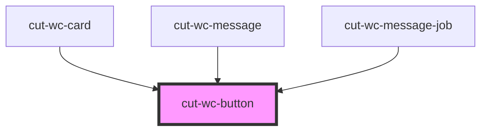

# cut-wc-button

<!-- Auto Generated Below -->

## Properties

| Property   | Attribute  | Description                                    | Type                             | Default     |
| ---------- | ---------- | ---------------------------------------------- | -------------------------------- | ----------- |
| `accent`   | `accent`   | Describe the accent button type                | `boolean`                        | `null`      |
| `disabled` | `disabled` | Gives you the option to disabled the button    | `boolean`                        | `false`     |
| `ghost`    | `ghost`    | Describe the ghost button type                 | `boolean`                        | `false`     |
| `positive` | `positive` | Describe the Ghost type                        | `boolean`                        | `false`     |
| `primary`  | `primary`  | Describe the primary button type               | `boolean`                        | `null`      |
| `size`     | `size`     | Gives the option to change the size of button. | `"large" \| "medium" \| "small"` | `"medium"`  |
| `tertiary` | `tertiary` | Describe the tertiary button type              | `boolean`                        | `null`      |
| `type`     | `type`     | Describe the type of button. e.g. Submit       | `string`                         | `undefined` |
| `warn`     | `warn`     | Describe the accent button type                | `boolean`                        | `null`      |

## Dependencies

### Used by

 - [cut-wc-card](../card)
 - [cut-wc-message](../message)
 - [cut-wc-message-job](../message/job)

### Graph

----------------------------------------------

*Built with [StencilJS](https://stenciljs.com/)*
