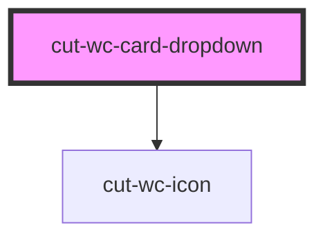

# cut-wc-card-dropdown

<!-- Auto Generated Below -->

## Properties

| Property       | Attribute     | Description | Type                      | Default       |
| -------------- | ------------- | ----------- | ------------------------- | ------------- |
| `dropdownData` | --            |             | `CardDropDownDataModal[]` | `undefined`   |
| `dropdownId`   | `dropdown-id` |             | `string`                  | `undefined`   |
| `icon`         | `icon`        |             | `string`                  | `"more_vert"` |

## Events

| Event     | Description | Type               |
| --------- | ----------- | ------------------ |
| `clicked` |             | `CustomEvent<any>` |

## Dependencies

### Depends on

- [cut-wc-icon](../icon)

### Graph

----------------------------------------------

*Built with [StencilJS](https://stenciljs.com/)*
