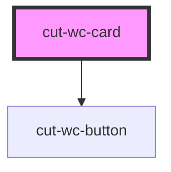

# cut-wc-card

<!-- Auto Generated Below -->

## Properties

| Property         | Attribute          | Description | Type                      | Default       |
| ---------------- | ------------------ | ----------- | ------------------------- | ------------- |
| `actionButtons`  | `action-buttons`   |             | `boolean`                 | `false`       |
| `cardId`         | `card-id`          |             | `any`                     | `null`        |
| `ctaText`        | `cta-text`         |             | `string`                  | `"Cancel"`    |
| `dropdownData`   | --                 |             | `CardDropDownDataModal[]` | `null`        |
| `heading`        | `heading`          |             | `string`                  | `undefined`   |
| `imageCaption`   | `image-caption`    |             | `string`                  | `undefined`   |
| `imageOnTop`     | `image-on-top`     |             | `boolean`                 | `false`       |
| `imageUrl`       | `image-url`        |             | `any`                     | `undefined`   |
| `onlyImage`      | `only-image`       |             | `boolean`                 | `false`       |
| `secondaCtaText` | `seconda-cta-text` |             | `string`                  | `"Secondary"` |
| `subheading`     | `subheading`       |             | `string`                  | `undefined`   |

## Events

| Event       | Description | Type               |
| ----------- | ----------- | ------------------ |
| `isClicked` |             | `CustomEvent<any>` |

## Dependencies

### Depends on

- [cut-wc-button](../button)

### Graph

----------------------------------------------

*Built with [StencilJS](https://stenciljs.com/)*
