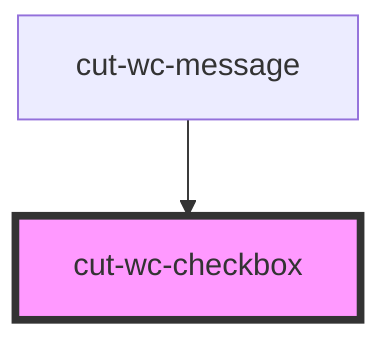

# cut-wc-checkbox

<!-- Auto Generated Below -->

## Properties

| Property    | Attribute   | Description | Type      | Default     |
| ----------- | ----------- | ----------- | --------- | ----------- |
| `accent`    | `accent`    |             | `boolean` | `undefined` |
| `checked`   | `checked`   |             | `boolean` | `false`     |
| `disabled`  | `disabled`  |             | `boolean` | `undefined` |
| `guideline` | `guideline` |             | `string`  | `undefined` |
| `name`      | `name`      |             | `string`  | `undefined` |
| `primary`   | `primary`   |             | `boolean` | `undefined` |
| `warn`      | `warn`      |             | `boolean` | `undefined` |

## Events

| Event         | Description | Type                      |
| ------------- | ----------- | ------------------------- |
| `inputUpdate` |             | `CustomEvent<Fieldprops>` |

## Dependencies

### Used by

 - [cut-wc-message](../message)

### Graph

----------------------------------------------

*Built with [StencilJS](https://stenciljs.com/)*
