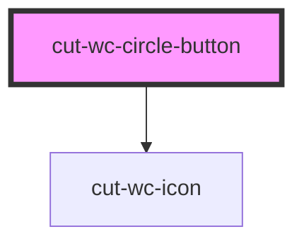

# cut-wc-circle-button

<!-- Auto Generated Below -->

## Properties

| Property  | Attribute | Description | Type      | Default     |
| --------- | --------- | ----------- | --------- | ----------- |
| `accent`  | `accent`  |             | `boolean` | `undefined` |
| `big`     | `big`     |             | `boolean` | `undefined` |
| `icon`    | `icon`    |             | `string`  | `"add"`     |
| `primary` | `primary` |             | `boolean` | `undefined` |

## Dependencies

### Depends on

- [cut-wc-icon](../icon)

### Graph

----------------------------------------------

*Built with [StencilJS](https://stenciljs.com/)*
