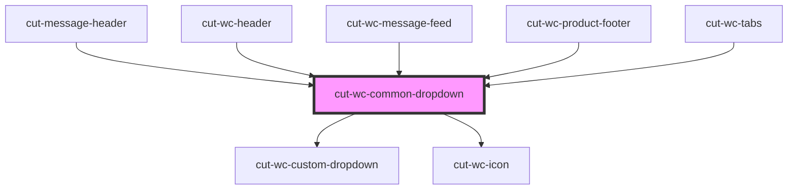

# cut-wc-common-dropdown

<!-- Auto Generated Below -->

## Properties

| Property            | Attribute             | Description | Type                | Default     |
| ------------------- | --------------------- | ----------- | ------------------- | ----------- |
| `dropDownData`      | --                    |             | `DropDownModal[]`   | `undefined` |
| `dropdownShowFrom`  | `dropdown-show-from`  |             | `"left" \| "right"` | `"right"`   |
| `hideBottomLine`    | `hide-bottom-line`    |             | `boolean`           | `false`     |
| `highlightSelected` | `highlight-selected`  |             | `boolean`           | `false`     |
| `highlightTopLabel` | `highlight-top-label` |             | `boolean`           | `false`     |
| `icon`              | `icon`                |             | `string`            | `"apps"`    |
| `showicon`          | `showicon`            |             | `boolean`           | `true`      |
| `toplabel`          | `toplabel`            |             | `string`            | `""`        |

## Events

| Event     | Description | Type               |
| --------- | ----------- | ------------------ |
| `clicked` |             | `CustomEvent<any>` |

## Dependencies

### Used by

 - [cut-message-header](../messenger/message-center/message-header)
 - [cut-wc-header](../header)
 - [cut-wc-message-feed](../messenger/message-feed)
 - [cut-wc-product-footer](../footer/footer-product)
 - [cut-wc-tabs](../tabs)

### Depends on

- [cut-wc-custom-dropdown](../custom-dropdown)
- [cut-wc-icon](../icon)

### Graph

----------------------------------------------

*Built with [StencilJS](https://stenciljs.com/)*
