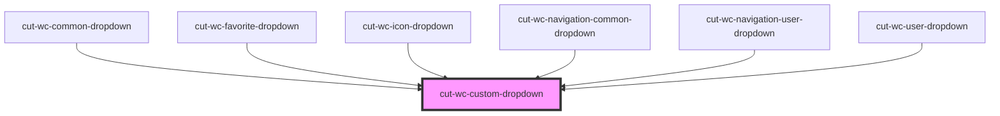

# cut-wc-custom-dropdown

<!-- Auto Generated Below -->

## Properties

| Property           | Attribute            | Description | Type                | Default             |
| ------------------ | -------------------- | ----------- | ------------------- | ------------------- |
| `dropdownShowFrom` | `dropdown-show-from` |             | `"left" \| "right"` | `"right"`           |
| `hideBottomLine`   | `hide-bottom-line`   |             | `boolean`           | `false`             |
| `origin`           | `origin`             |             | `string`            | `"custom-dropdown"` |

## Events

| Event             | Description | Type                      |
| ----------------- | ----------- | ------------------------- |
| `dropdownClicked` |             | `CustomEvent<EventModal>` |

## Dependencies

### Used by

 - [cut-wc-common-dropdown](../common-dropdown)
 - [cut-wc-favorite-dropdown](../favorite-dropdown)
 - [cut-wc-icon-dropdown](../icon-dropdown)
 - [cut-wc-navigation-common-dropdown](../navigation/common-dropdown)
 - [cut-wc-navigation-user-dropdown](../navigation/user-dropdown)
 - [cut-wc-user-dropdown](../user-dropdown)

### Graph

----------------------------------------------

*Built with [StencilJS](https://stenciljs.com/)*
