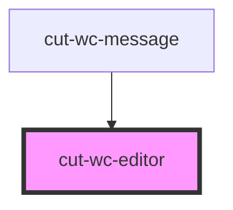

# cut-wc-editor

<!-- Auto Generated Below -->

## Properties

| Property                 | Attribute                | Description | Type       | Default                 |
| ------------------------ | ------------------------ | ----------- | ---------- | ----------------------- |
| `editorId`               | `editor-id`              |             | `string`   | `undefined`             |
| `html`                   | `html`                   |             | `string`   | `""`                    |
| `inline`                 | `inline`                 |             | `boolean`  | `true`                  |
| `menubar`                | `menubar`                |             | `boolean`  | `false`                 |
| `plugins`                | --                       |             | `string[]` | `["link"]`              |
| `powerpaste_html_import` | `powerpaste_html_import` |             | `string`   | `"clean"`               |
| `powerpaste_word_import` | `powerpaste_word_import` |             | `string`   | `"clean"`               |
| `toolbar`                | --                       |             | `string[]` | `["undo redo \| link"]` |
| `valid_elements`         | `valid_elements`         |             | `string`   | `undefined`             |
| `valid_styles`           | `valid_styles`           |             | `any`      | `undefined`             |

## Events

| Event         | Description | Type               |
| ------------- | ----------- | ------------------ |
| `getEditor`   |             | `CustomEvent<any>` |
| `getKeyInput` |             | `CustomEvent<any>` |
| `htmlChange`  |             | `CustomEvent<any>` |

## Dependencies

### Used by

 - [cut-wc-message](../message)

### Graph

----------------------------------------------

*Built with [StencilJS](https://stenciljs.com/)*
