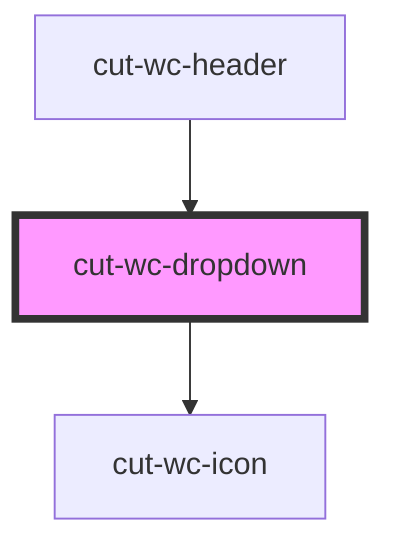

# cut-wc-dropdown

<!-- Auto Generated Below -->

## Properties

| Property             | Attribute               | Description | Type                | Default     |
| -------------------- | ----------------------- | ----------- | ------------------- | ----------- |
| `dropdownData`       | --                      |             | `DropDownDataModal` | `undefined` |
| `highlightBasedOnId` | `highlight-based-on-id` |             | `boolean`           | `false`     |
| `selectedNav`        | `selected-nav`          |             | `string`            | `undefined` |

## Events

| Event     | Description | Type               |
| --------- | ----------- | ------------------ |
| `clicked` |             | `CustomEvent<any>` |

## Dependencies

### Used by

 - [cut-wc-header](../header)

### Depends on

- [cut-wc-icon](../icon)

### Graph

----------------------------------------------

*Built with [StencilJS](https://stenciljs.com/)*
