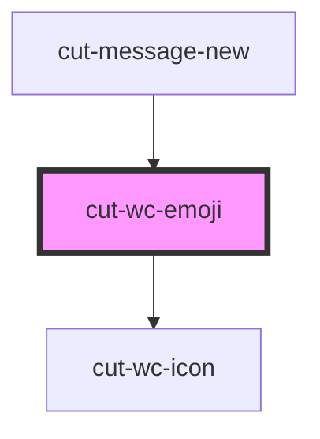

# cut-wc-emoji

<!-- Auto Generated Below -->

## Properties

| Property        | Attribute         | Description | Type     | Default     |
| --------------- | ----------------- | ----------- | -------- | ----------- |
| `labelColor`    | `label-color`     |             | `string` | `undefined` |
| `labelFontSize` | `label-font-size` |             | `string` | `undefined` |

## Events

| Event         | Description | Type                               |
| ------------- | ----------- | ---------------------------------- |
| `emojiPicked` |             | `CustomEvent<{ emoji?: string; }>` |

## Dependencies

### Used by

 - [cut-message-new](../messenger/message-center/new-message)

### Depends on

- [cut-wc-icon](../icon)

### Graph

----------------------------------------------

*Built with [StencilJS](https://stenciljs.com/)*
