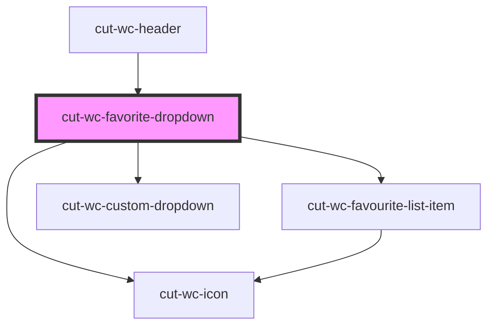

# cut-wc-favorite-dropdown

<!-- Auto Generated Below -->

## Properties

| Property        | Attribute | Description | Type                  | Default     |
| --------------- | --------- | ----------- | --------------------- | ----------- |
| `count`         | `count`   |             | `string`              | `"10"`      |
| `favoriteItems` | --        |             | `FavoriteItemModal[]` | `undefined` |
| `heading`       | `heading` |             | `string`              | `undefined` |
| `mainLink`      | --        |             | `mainLinkModal`       | `undefined` |

## Events

| Event     | Description | Type                         |
| --------- | ----------- | ---------------------------- |
| `clicked` |             | `CustomEvent<mainLinkModal>` |

## Dependencies

### Used by

 - [cut-wc-header](../header)

### Depends on

- [cut-wc-favourite-list-item](../list/favourite-list-item)
- [cut-wc-custom-dropdown](../custom-dropdown)
- [cut-wc-icon](../icon)

### Graph

----------------------------------------------

*Built with [StencilJS](https://stenciljs.com/)*
