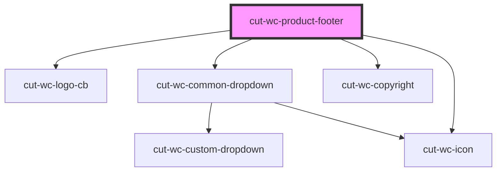

# cut-wc-product-footer

<!-- Auto Generated Below -->

## Properties

| Property        | Attribute        | Description | Type              | Default     |
| --------------- | ---------------- | ----------- | ----------------- | ----------- |
| `footerData`    | --               |             | `FooterDataModal` | `undefined` |
| `hideCopyright` | `hide-copyright` |             | `boolean`         | `false`     |

## Events

| Event     | Description | Type               |
| --------- | ----------- | ------------------ |
| `clicked` |             | `CustomEvent<any>` |

## Dependencies

### Depends on

- [cut-wc-logo-cb](../../logo-cb)
- [cut-wc-common-dropdown](../../common-dropdown)
- [cut-wc-copyright](../copyright)
- [cut-wc-icon](../../icon)

### Graph

----------------------------------------------

*Built with [StencilJS](https://stenciljs.com/)*
