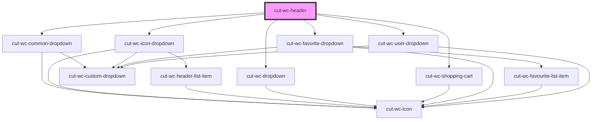

# cut-wc-header

<!-- Auto Generated Below -->

## Properties

| Property           | Attribute           | Description | Type                    | Default     |
| ------------------ | ------------------- | ----------- | ----------------------- | ----------- |
| `IconListDropdown` | --                  |             | `IconListDataModel[]`   | `undefined` |
| `commonDropdown`   | --                  |             | `commonDropdownModal[]` | `undefined` |
| `favoriteDropdown` | --                  |             | `FavoriteDropdownModal` | `undefined` |
| `headerImagePath`  | `header-image-path` |             | `string`                | `undefined` |
| `navigation`       | --                  |             | `DropDownDataModal`     | `undefined` |
| `noDropShadow`     | `no-drop-shadow`    |             | `boolean`               | `undefined` |
| `shoppingCart`     | --                  |             | `ShoppingCartModel`     | `undefined` |
| `userDropDown`     | --                  |             | `UserDropDownModal[]`   | `undefined` |
| `userInfo`         | --                  |             | `UserInfoModal`         | `undefined` |

## Events

| Event     | Description | Type                      |
| --------- | ----------- | ------------------------- |
| `clicked` |             | `CustomEvent<EventModal>` |

## Dependencies

### Depends on

- [cut-wc-common-dropdown](../common-dropdown)
- [cut-wc-icon-dropdown](../icon-dropdown)
- [cut-wc-dropdown](../dropdown)
- [cut-wc-shopping-cart](../shopping-cart)
- [cut-wc-favorite-dropdown](../favorite-dropdown)
- [cut-wc-user-dropdown](../user-dropdown)

### Graph

----------------------------------------------

*Built with [StencilJS](https://stenciljs.com/)*
