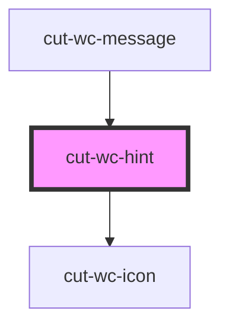

# cut-wc-hint

<!-- Auto Generated Below -->

## Properties

| Property  | Attribute | Description | Type      | Default     |
| --------- | --------- | ----------- | --------- | ----------- |
| `bottom`  | `bottom`  |             | `boolean` | `undefined` |
| `heading` | `heading` |             | `string`  | `undefined` |
| `icon`    | `icon`    |             | `string`  | `"info"`    |
| `left`    | `left`    |             | `boolean` | `undefined` |
| `open`    | `open`    |             | `boolean` | `undefined` |
| `right`   | `right`   |             | `boolean` | `undefined` |
| `top`     | `top`     |             | `boolean` | `undefined` |

## Methods

### `closeHint() => Promise<void>`

#### Returns

Type: `Promise<void>`

### `openHint() => Promise<void>`

#### Returns

Type: `Promise<void>`

## Dependencies

### Used by

 - [cut-wc-message](../message)

### Depends on

- [cut-wc-icon](../icon)

### Graph

----------------------------------------------

*Built with [StencilJS](https://stenciljs.com/)*
