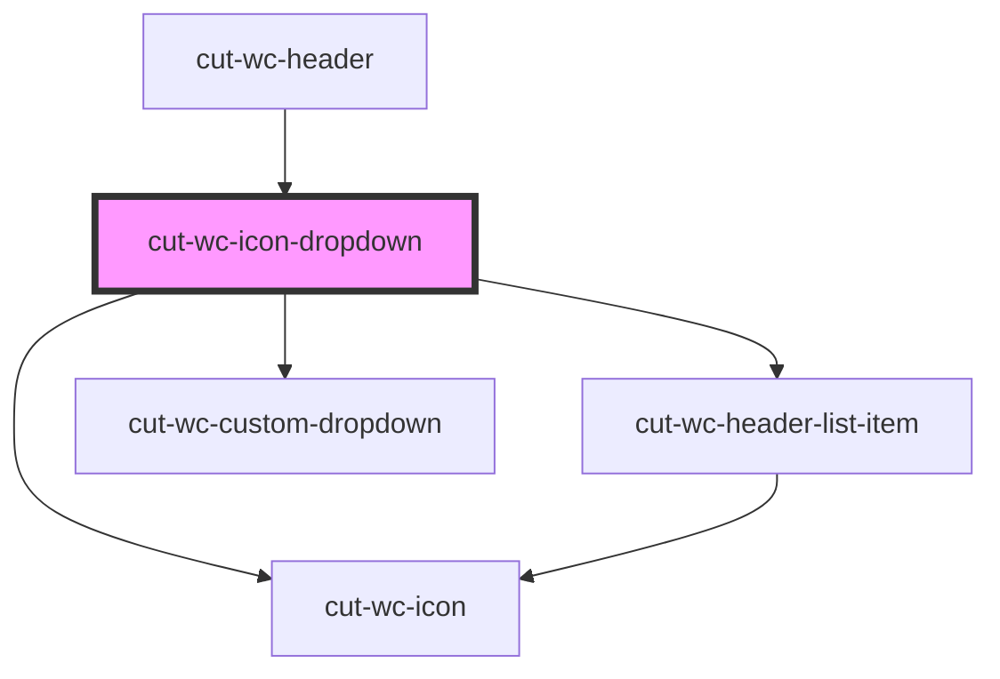

# cut-wc-icon-dropdown

<!-- Auto Generated Below -->

## Properties

| Property        | Attribute         | Description | Type                      | Default      |
| --------------- | ----------------- | ----------- | ------------------------- | ------------ |
| `count`         | `count`           |             | `string`                  | `undefined`  |
| `heading`       | `heading`         |             | `string`                  | `undefined`  |
| `icon`          | `icon`            |             | `string`                  | `undefined`  |
| `items`         | --                |             | `IconListItemDataModel[]` | `undefined`  |
| `mainLink`      | --                |             | `mainLinkModal`           | `undefined`  |
| `mainLinkLabel` | `main-link-label` |             | `string`                  | `'View All'` |
| `origin`        | `origin`          |             | `string`                  | `undefined`  |
| `topLabelColor` | `top-label-color` |             | `string`                  | `'inherit'`  |
| `topLabelSize`  | `top-label-size`  |             | `string`                  | `'inherit'`  |

## Events

| Event     | Description | Type                         |
| --------- | ----------- | ---------------------------- |
| `clicked` |             | `CustomEvent<mainLinkModal>` |

## Dependencies

### Used by

 - [cut-wc-header](../header)

### Depends on

- [cut-wc-header-list-item](../list/header-list-item)
- [cut-wc-custom-dropdown](../custom-dropdown)
- [cut-wc-icon](../icon)

### Graph

----------------------------------------------

*Built with [StencilJS](https://stenciljs.com/)*
