# cut-wc-icon

<!-- Auto Generated Below -->

## Properties

| Property | Attribute | Description | Type     | Default |
| -------- | --------- | ----------- | -------- | ------- |
| `icon`   | `icon`    |             | `string` | `null`  |

## Dependencies

### Used by

 - [cut-message-new](../messenger/message-center/new-message)
 - [cut-wc-auto-complete](../auto-complete)
 - [cut-wc-card-dropdown](../card-dropdown)
 - [cut-wc-circle-button](../circle-button)
 - [cut-wc-common-dropdown](../common-dropdown)
 - [cut-wc-dropdown](../dropdown)
 - [cut-wc-emoji](../emoji)
 - [cut-wc-favorite-dropdown](../favorite-dropdown)
 - [cut-wc-favourite-list-item](../list/favourite-list-item)
 - [cut-wc-header-list-item](../list/header-list-item)
 - [cut-wc-hint](../hint)
 - [cut-wc-icon-dropdown](../icon-dropdown)
 - [cut-wc-info-card](../info-card)
 - [cut-wc-input](../input)
 - [cut-wc-kpi-tile](../kpi-tile)
 - [cut-wc-link](../link)
 - [cut-wc-message](../message)
 - [cut-wc-message-job](../message/job)
 - [cut-wc-messenger](../messenger)
 - [cut-wc-navigation-common-dropdown](../navigation/common-dropdown)
 - [cut-wc-navigation-dropdown](../navigation/navigation-dropdown)
 - [cut-wc-navigation-user-dropdown](../navigation/user-dropdown)
 - [cut-wc-notification](../notification)
 - [cut-wc-pill](../pills)
 - [cut-wc-popup](../popup)
 - [cut-wc-product-footer](../footer/footer-product)
 - [cut-wc-select](../select)
 - [cut-wc-shopping-cart](../shopping-cart)
 - [cut-wc-stepper](../stepper)
 - [cut-wc-text-area](../text-area)
 - [cut-wc-tooltip](../tooltip)
 - [cut-wc-user-dropdown](../user-dropdown)
 - [cut-wc-web-footer](../footer/footer-web)

### Graph

```mermaid
graph TD;
  cut-message-new --> cut-wc-icon
  cut-wc-auto-complete --> cut-wc-icon
  cut-wc-card-dropdown --> cut-wc-icon
  cut-wc-circle-button --> cut-wc-icon
  cut-wc-common-dropdown --> cut-wc-icon
  cut-wc-dropdown --> cut-wc-icon
  cut-wc-emoji --> cut-wc-icon
  cut-wc-favorite-dropdown --> cut-wc-icon
  cut-wc-favourite-list-item --> cut-wc-icon
  cut-wc-header-list-item --> cut-wc-icon
  cut-wc-hint --> cut-wc-icon
  cut-wc-icon-dropdown --> cut-wc-icon
  cut-wc-info-card --> cut-wc-icon
  cut-wc-input --> cut-wc-icon
  cut-wc-kpi-tile --> cut-wc-icon
  cut-wc-link --> cut-wc-icon
  cut-wc-message --> cut-wc-icon
  cut-wc-message-job --> cut-wc-icon
  cut-wc-messenger --> cut-wc-icon
  cut-wc-navigation-common-dropdown --> cut-wc-icon
  cut-wc-navigation-dropdown --> cut-wc-icon
  cut-wc-navigation-user-dropdown --> cut-wc-icon
  cut-wc-notification --> cut-wc-icon
  cut-wc-pill --> cut-wc-icon
  cut-wc-popup --> cut-wc-icon
  cut-wc-product-footer --> cut-wc-icon
  cut-wc-select --> cut-wc-icon
  cut-wc-shopping-cart --> cut-wc-icon
  cut-wc-stepper --> cut-wc-icon
  cut-wc-text-area --> cut-wc-icon
  cut-wc-tooltip --> cut-wc-icon
  cut-wc-user-dropdown --> cut-wc-icon
  cut-wc-web-footer --> cut-wc-icon
  style cut-wc-icon fill:#f9f,stroke:#333,stroke-width:4px
```

----------------------------------------------

*Built with [StencilJS](https://stenciljs.com/)*
