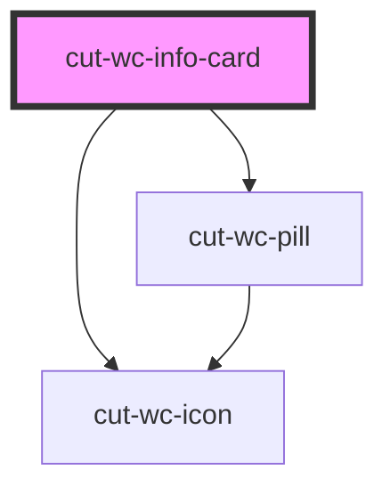

# cut-wc-info-card

<!-- Auto Generated Below -->

## Properties

| Property         | Attribute          | Description | Type                      | Default             |
| ---------------- | ------------------ | ----------- | ------------------------- | ------------------- |
| `address`        | `address`          |             | `string`                  | `undefined`         |
| `cardId`         | `card-id`          |             | `string`                  | `undefined`         |
| `dropdownData`   | --                 |             | `CardDropDownDataModal[]` | `null`              |
| `firstPillText`  | `first-pill-text`  |             | `string`                  | `undefined`         |
| `highlightText`  | `highlight-text`   |             | `string`                  | `undefined`         |
| `icon`           | `icon`             |             | `string`                  | `"desktop_windows"` |
| `positionName`   | `position-name`    |             | `string`                  | `undefined`         |
| `positionTitle`  | `position-title`   |             | `string`                  | `undefined`         |
| `secondPillText` | `second-pill-text` |             | `string`                  | `undefined`         |
| `secondaryText`  | `secondary-text`   |             | `string`                  | `undefined`         |
| `showPills`      | `show-pills`       |             | `boolean`                 | `false`             |
| `small`          | `small`            |             | `boolean`                 | `undefined`         |

## Dependencies

### Depends on

- [cut-wc-icon](../icon)
- [cut-wc-pill](../pills)

### Graph

----------------------------------------------

*Built with [StencilJS](https://stenciljs.com/)*
