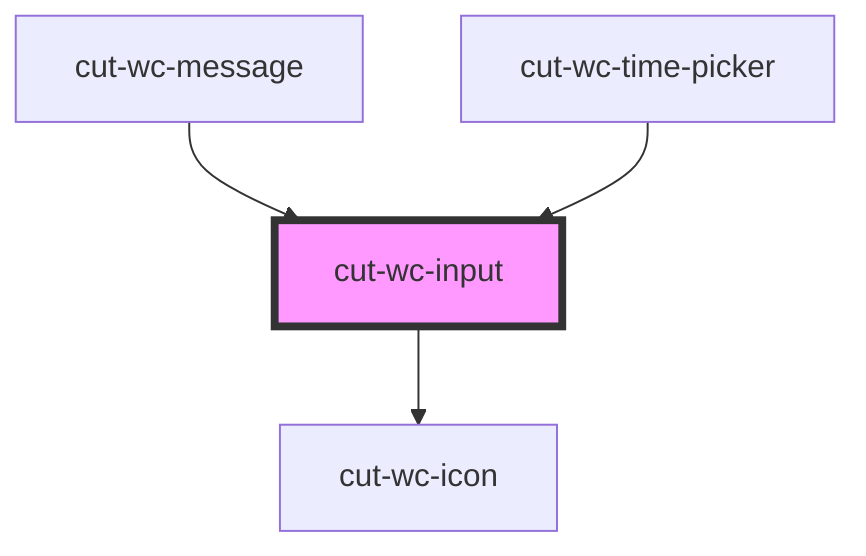

# cut-wc-input

<!-- Auto Generated Below -->

## Properties

| Property    | Attribute   | Description | Type      | Default     |
| ----------- | ----------- | ----------- | --------- | ----------- |
| `disabled`  | `disabled`  |             | `boolean` | `false`     |
| `error`     | `error`     |             | `boolean` | `undefined` |
| `guideline` | `guideline` |             | `string`  | `undefined` |
| `icon`      | `icon`      |             | `string`  | `undefined` |
| `label`     | `label`     |             | `string`  | `undefined` |
| `name`      | `name`      |             | `string`  | `undefined` |
| `readonly`  | `readonly`  |             | `boolean` | `false`     |
| `require`   | `require`   |             | `boolean` | `undefined` |
| `success`   | `success`   |             | `boolean` | `undefined` |
| `type`      | `type`      |             | `string`  | `undefined` |
| `value`     | `value`     |             | `string`  | `undefined` |

## Events

| Event           | Description | Type                      |
| --------------- | ----------- | ------------------------- |
| `inputChange`   |             | `CustomEvent<Fieldprops>` |
| `inputUpdate`   |             | `CustomEvent<Fieldprops>` |
| `keyDownChange` |             | `CustomEvent<Fieldprops>` |
| `keyUpChange`   |             | `CustomEvent<Fieldprops>` |

## Dependencies

### Used by

 - [cut-wc-message](../message)
 - [cut-wc-time-picker](../time-picker)

### Depends on

- [cut-wc-icon](../icon)

### Graph

----------------------------------------------

*Built with [StencilJS](https://stenciljs.com/)*
