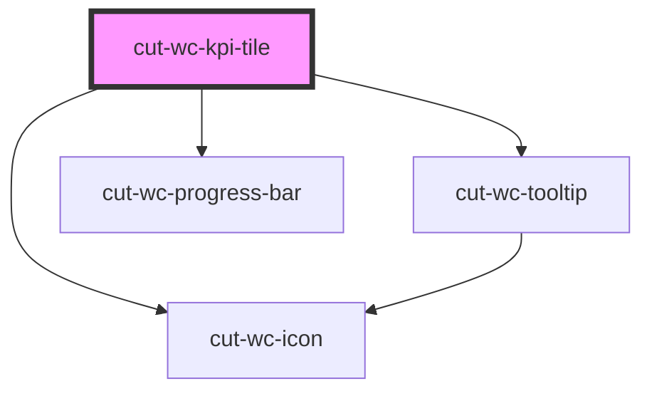

# cut-wc-card

<!-- Auto Generated Below -->

## Properties

| Property | Attribute | Description | Type          | Default     |
| -------- | --------- | ----------- | ------------- | ----------- |
| `data`   | --        |             | `KpiTileData` | `undefined` |

## Dependencies

### Depends on

- [cut-wc-tooltip](../tooltip)
- [cut-wc-progress-bar](../progress-bar)
- [cut-wc-icon](../icon)

### Graph

----------------------------------------------

*Built with [StencilJS](https://stenciljs.com/)*
