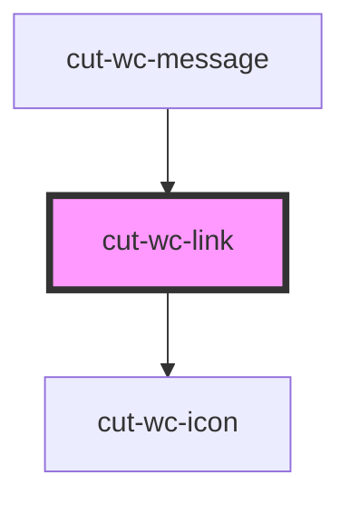

# cut-wc-link

<!-- Auto Generated Below -->

## Properties

| Property   | Attribute  | Description | Type      | Default     |
| ---------- | ---------- | ----------- | --------- | ----------- |
| `disabled` | `disabled` |             | `boolean` | `undefined` |
| `href`     | `href`     |             | `string`  | `undefined` |
| `icon`     | `icon`     |             | `string`  | `undefined` |
| `small`    | `small`    |             | `boolean` | `undefined` |
| `target`   | `target`   |             | `string`  | `undefined` |

## Dependencies

### Used by

 - [cut-wc-message](../message)

### Depends on

- [cut-wc-icon](../icon)

### Graph

----------------------------------------------

*Built with [StencilJS](https://stenciljs.com/)*
