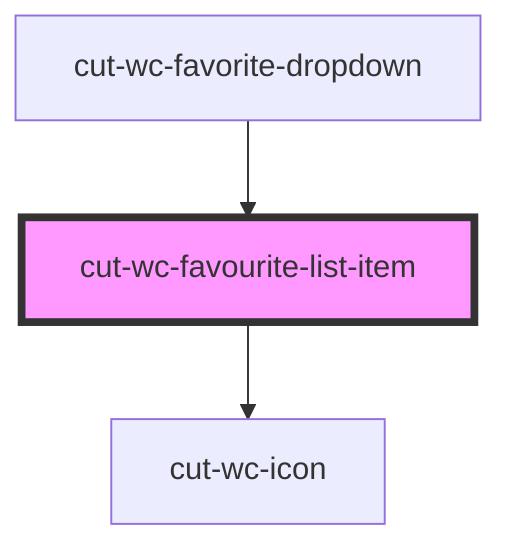

# cut-wc-favourite-list-item

<!-- Auto Generated Below -->

## Properties

| Property        | Attribute | Description | Type                | Default     |
| --------------- | --------- | ----------- | ------------------- | ----------- |
| `favouriteData` | --        |             | `FavoriteItemModal` | `undefined` |

## Events

| Event     | Description | Type                             |
| --------- | ----------- | -------------------------------- |
| `clicked` |             | `CustomEvent<FavoriteItemModal>` |

## Dependencies

### Used by

 - [cut-wc-favorite-dropdown](../../favorite-dropdown)

### Depends on

- [cut-wc-icon](../../icon)

### Graph

----------------------------------------------

*Built with [StencilJS](https://stenciljs.com/)*
