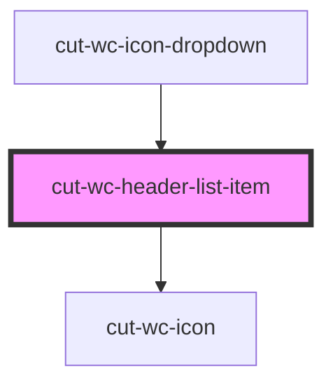

# cut-wc-header-list-item

<!-- Auto Generated Below -->

## Properties

| Property | Attribute | Description | Type                    | Default     |
| -------- | --------- | ----------- | ----------------------- | ----------- |
| `data`   | --        |             | `IconListItemDataModel` | `undefined` |

## Events

| Event     | Description | Type                                 |
| --------- | ----------- | ------------------------------------ |
| `clicked` |             | `CustomEvent<IconListItemDataModel>` |

## Dependencies

### Used by

 - [cut-wc-icon-dropdown](../../icon-dropdown)

### Depends on

- [cut-wc-icon](../../icon)

### Graph

----------------------------------------------

*Built with [StencilJS](https://stenciljs.com/)*
