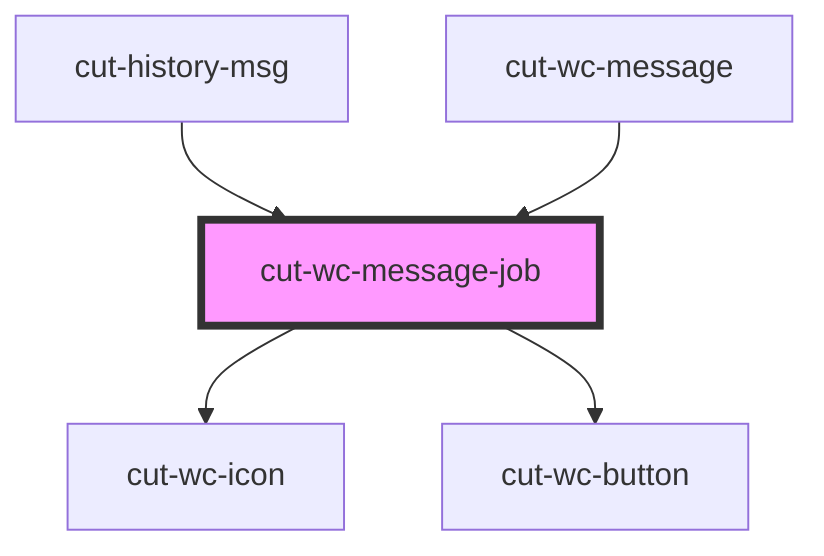

# cut-message-job

<!-- Auto Generated Below -->

## Properties

| Property            | Attribute             | Description | Type         | Default     |
| ------------------- | --------------------- | ----------- | ------------ | ----------- |
| `fromMessageCenter` | `from-message-center` |             | `boolean`    | `false`     |
| `job`               | --                    |             | `MessageJob` | `undefined` |
| `message`           | `message`             |             | `string`     | `''`        |

## Events

| Event         | Description | Type               |
| ------------- | ----------- | ------------------ |
| `clickApply`  |             | `CustomEvent<any>` |
| `clickDetail` |             | `CustomEvent<any>` |

## Dependencies

### Used by

 - [cut-history-msg](../../messenger/message-center/history/msg)
 - [cut-wc-message](..)

### Depends on

- [cut-wc-icon](../../icon)
- [cut-wc-button](../../button)

### Graph

----------------------------------------------

*Built with [StencilJS](https://stenciljs.com/)*
