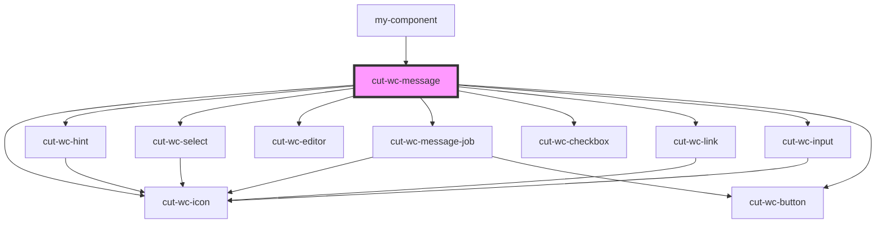

# cut-wc-message

<!-- Auto Generated Below -->

## Properties

| Property    | Attribute | Description | Type                        | Default                                                                                                                                                                             |
| ----------- | --------- | ----------- | --------------------------- | ----------------------------------------------------------------------------------------------------------------------------------------------------------------------------------- |
| `job`       | `job`     |             | `any`                       | `undefined`                                                                                                                                                                         |
| `message`   | --        |             | `Message`                   | `{     title: "",     body: "",     greeting: "",     templateName: "",     sendSms: false,     template: { value: "test" },     isSaveAction: false,     enableSendSms: false   }` |
| `templates` | --        |             | `SelectDropDownDataModal[]` | `undefined`                                                                                                                                                                         |

## Events

| Event                   | Description | Type                      |
| ----------------------- | ----------- | ------------------------- |
| `deleteTemplate`        |             | `CustomEvent<EventModal>` |
| `getEditor`             |             | `CustomEvent<any>`        |
| `keyUpChanges`          |             | `CustomEvent<Message>`    |
| `saveTemplate`          |             | `CustomEvent<EventModal>` |
| `templateSelected`      |             | `CustomEvent<EventModal>` |
| `toggleSaveNewTemplate` |             | `CustomEvent<boolean>`    |
| `valueChanges`          |             | `CustomEvent<Message>`    |

## Dependencies

### Used by

 - [my-component](../../local-wrappers/my-component)

### Depends on

- [cut-wc-icon](../icon)
- [cut-wc-hint](../hint)
- [cut-wc-select](../select)
- [cut-wc-editor](../cut-wc-editor)
- [cut-wc-message-job](job)
- [cut-wc-checkbox](../checkbox)
- [cut-wc-link](../link)
- [cut-wc-input](../input)
- [cut-wc-button](../button)

### Graph

----------------------------------------------

*Built with [StencilJS](https://stenciljs.com/)*
