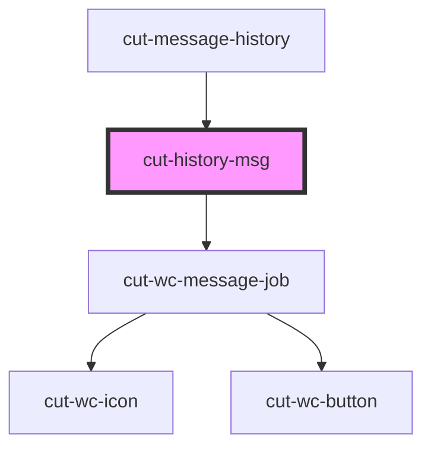

# cut-history-msg

<!-- Auto Generated Below -->

## Properties

| Property        | Attribute         | Description | Type                                                   | Default     |
| --------------- | ----------------- | ----------- | ------------------------------------------------------ | ----------- |
| `currentUserId` | `current-user-id` |             | `string`                                               | `undefined` |
| `msg`           | --                |             | `EventMessageModal \| JobMessageModal \| MsgDataModal` | `undefined` |

## Dependencies

### Used by

 - [cut-message-history](..)

### Depends on

- [cut-wc-message-job](../../../../message/job)

### Graph

----------------------------------------------

*Built with [StencilJS](https://stenciljs.com/)*
