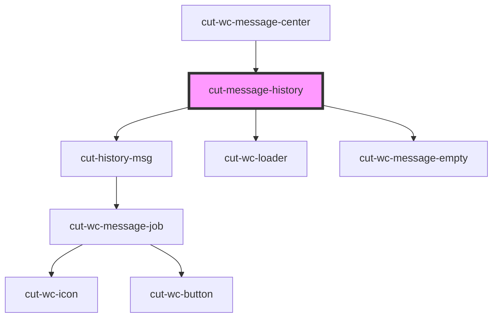

# cut-message-history

<!-- Auto Generated Below -->

## Properties

| Property             | Attribute             | Description | Type                                                                                                                               | Default     |
| -------------------- | --------------------- | ----------- | ---------------------------------------------------------------------------------------------------------------------------------- | ----------- |
| `conversationLoader` | `conversation-loader` |             | `boolean`                                                                                                                          | `false`     |
| `currentEvent`       | `current-event`       |             | `"actionUpdate" \| "feedItemClicked" \| "filterChange" \| "headerTitleClicked" \| "msgSubmit" \| "scrollEnded" \| "scrollUpEnded"` | `undefined` |
| `currentUserId`      | `current-user-id`     |             | `string`                                                                                                                           | `undefined` |
| `msgs`               | --                    |             | `MsgDataModal[]`                                                                                                                   | `undefined` |
| `newMsgLoader`       | `new-msg-loader`      |             | `boolean`                                                                                                                          | `false`     |

## Events

| Event           | Description | Type                   |
| --------------- | ----------- | ---------------------- |
| `scrollUpEnded` |             | `CustomEvent<boolean>` |

## Dependencies

### Used by

 - [cut-wc-message-center](..)

### Depends on

- [cut-history-msg](msg)
- [cut-wc-loader](../../../skeleton-loader)
- [cut-wc-message-empty](../../message-empty)

### Graph

----------------------------------------------

*Built with [StencilJS](https://stenciljs.com/)*
