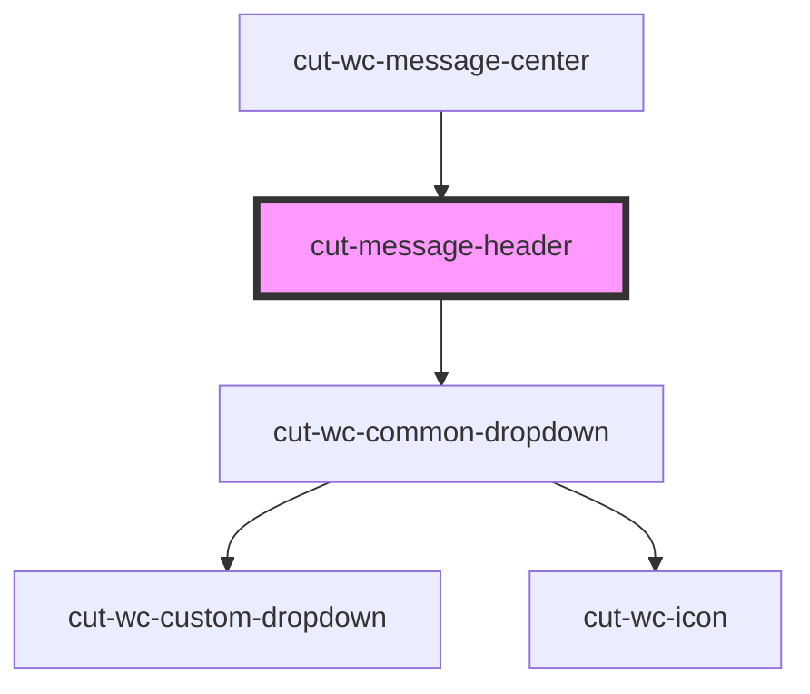

# cut-message-header

<!-- Auto Generated Below -->

## Properties

| Property  | Attribute | Description | Type                      | Default     |
| --------- | --------- | ----------- | ------------------------- | ----------- |
| `actions` | --        |             | `DropDownModal[]`         | `undefined` |
| `config`  | --        |             | `ConfigModal`             | `undefined` |
| `header`  | --        |             | `ConversationHeaderModal` | `undefined` |

## Events

| Event                | Description | Type                         |
| -------------------- | ----------- | ---------------------------- |
| `actionUpdate`       |             | `CustomEvent<DropDownModal>` |
| `headerTitleClicked` |             | `CustomEvent<boolean>`       |

## Dependencies

### Used by

 - [cut-wc-message-center](..)

### Depends on

- [cut-wc-common-dropdown](../../../common-dropdown)

### Graph

----------------------------------------------

*Built with [StencilJS](https://stenciljs.com/)*
