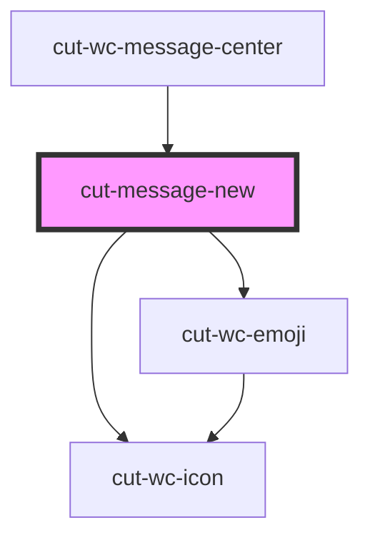

# cut-message-new

<!-- Auto Generated Below -->

## Properties

| Property    | Attribute | Description | Type                   | Default                 |
| ----------- | --------- | ----------- | ---------------------- | ----------------------- |
| `config`    | --        |             | `ConfigModal`          | `undefined`             |
| `inputData` | --        |             | `NewMessageInputModal` | `getDefaultInputData()` |

## Events

| Event       | Description | Type                   |
| ----------- | ----------- | ---------------------- |
| `msgSubmit` |             | `CustomEvent<boolean>` |

## Dependencies

### Used by

 - [cut-wc-message-center](..)

### Depends on

- [cut-wc-emoji](../../../emoji)
- [cut-wc-icon](../../../icon)

### Graph

----------------------------------------------

*Built with [StencilJS](https://stenciljs.com/)*
