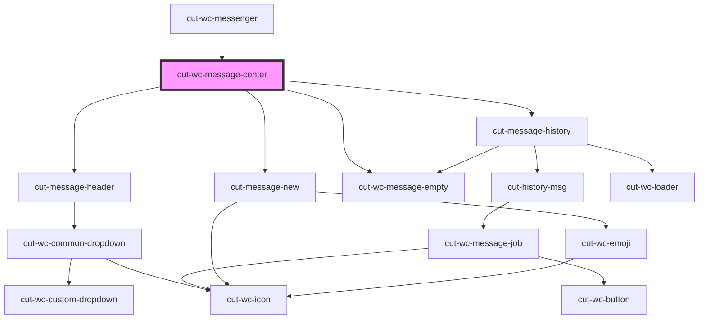

# cut-wc-message-center

<!-- Auto Generated Below -->

## Properties

| Property             | Attribute             | Description | Type                                                                                                                               | Default     |
| -------------------- | --------------------- | ----------- | ---------------------------------------------------------------------------------------------------------------------------------- | ----------- |
| `actions`            | --                    |             | `DropDownModal[]`                                                                                                                  | `undefined` |
| `config`             | --                    |             | `ConfigModal`                                                                                                                      | `undefined` |
| `conversationLoader` | `conversation-loader` |             | `boolean`                                                                                                                          | `undefined` |
| `currentEvent`       | `current-event`       |             | `"actionUpdate" \| "feedItemClicked" \| "filterChange" \| "headerTitleClicked" \| "msgSubmit" \| "scrollEnded" \| "scrollUpEnded"` | `undefined` |
| `currentUserId`      | `current-user-id`     |             | `string`                                                                                                                           | `undefined` |
| `header`             | --                    |             | `ConversationHeaderModal`                                                                                                          | `undefined` |
| `inputData`          | --                    |             | `NewMessageInputModal`                                                                                                             | `undefined` |
| `msgs`               | --                    |             | `EventMessageModal[] \| JobMessageModal[] \| MsgDataModal[]`                                                                       | `undefined` |
| `newMsgLoader`       | `new-msg-loader`      |             | `boolean`                                                                                                                          | `undefined` |
| `selectedId`         | `selected-id`         |             | `string`                                                                                                                           | `undefined` |

## Dependencies

### Used by

 - [cut-wc-messenger](..)

### Depends on

- [cut-message-header](message-header)
- [cut-message-history](history)
- [cut-message-new](new-message)
- [cut-wc-message-empty](../message-empty)

### Graph

----------------------------------------------

*Built with [StencilJS](https://stenciljs.com/)*
