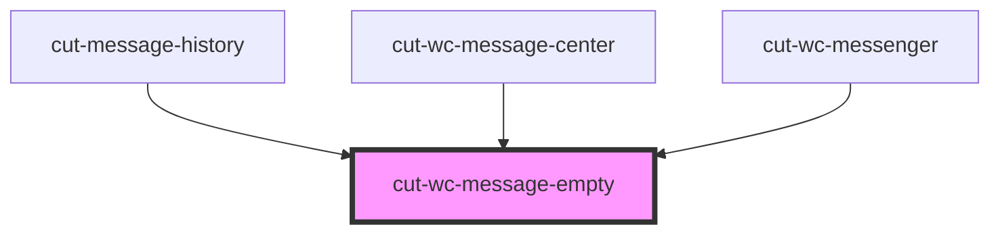

# cut-wc-message-empty

<!-- Auto Generated Below -->

## Properties

| Property    | Attribute     | Description | Type      | Default                                   |
| ----------- | ------------- | ----------- | --------- | ----------------------------------------- |
| `noDataMsg` | `no-data-msg` |             | `string`  | `'You do not have any conversations yet'` |
| `noWrapper` | `no-wrapper`  |             | `boolean` | `false`                                   |

## Dependencies

### Used by

 - [cut-message-history](../message-center/history)
 - [cut-wc-message-center](../message-center)
 - [cut-wc-messenger](..)

### Graph

----------------------------------------------

*Built with [StencilJS](https://stenciljs.com/)*
