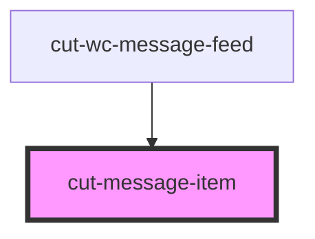

# cut-message-item

<!-- Auto Generated Below -->

## Properties

| Property        | Attribute | Description | Type       | Default     |
| --------------- | --------- | ----------- | ---------- | ----------- |
| `currentUserId` | --        |             | `String`   | `undefined` |
| `isSelected`    | --        |             | `Boolean`  | `undefined` |
| `item`          | --        |             | `FeedItem` | `undefined` |

## Events

| Event             | Description | Type                    |
| ----------------- | ----------- | ----------------------- |
| `feedItemClicked` |             | `CustomEvent<FeedItem>` |

## Dependencies

### Used by

 - [cut-wc-message-feed](..)

### Graph

----------------------------------------------

*Built with [StencilJS](https://stenciljs.com/)*
