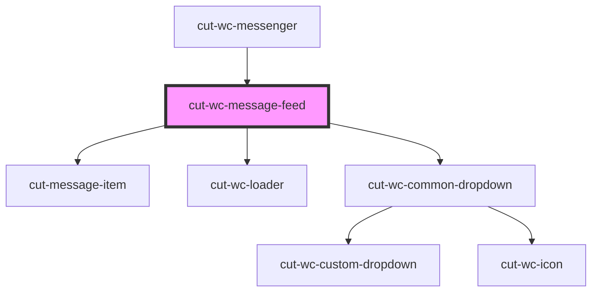

# cut-wc-message-feed

<!-- Auto Generated Below -->

## Properties

| Property           | Attribute            | Description | Type              | Default     |
| ------------------ | -------------------- | ----------- | ----------------- | ----------- |
| `currentUserId`    | --                   |             | `String`          | `undefined` |
| `feedItems`        | --                   |             | `FeedItem[]`      | `undefined` |
| `filterData`       | --                   |             | `DropDownModal[]` | `undefined` |
| `noDataMsg`        | `no-data-msg`        |             | `string`          | `undefined` |
| `selectedId`       | `selected-id`        |             | `string`          | `undefined` |
| `showFeedLoader`   | `show-feed-loader`   |             | `boolean`         | `false`     |
| `showScrollLoader` | `show-scroll-loader` |             | `boolean`         | `false`     |

## Events

| Event          | Description | Type                         |
| -------------- | ----------- | ---------------------------- |
| `filterChange` |             | `CustomEvent<DropDownModal>` |
| `scrollEnded`  |             | `CustomEvent<boolean>`       |

## Dependencies

### Used by

 - [cut-wc-messenger](..)

### Depends on

- [cut-message-item](item)
- [cut-wc-loader](../../skeleton-loader)
- [cut-wc-common-dropdown](../../common-dropdown)

### Graph

----------------------------------------------

*Built with [StencilJS](https://stenciljs.com/)*
