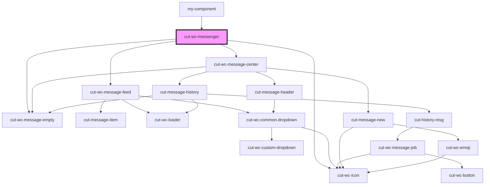

# cut-wc-messenger

<!-- Auto Generated Below -->

## Properties

| Property        | Attribute | Description | Type                 | Default     |
| --------------- | --------- | ----------- | -------------------- | ----------- |
| `messengerData` | --        |             | `MessengerDataModal` | `undefined` |

## Events

| Event             | Description | Type                              |
| ----------------- | ----------- | --------------------------------- |
| `messengerUpdate` |             | `CustomEvent<MessengerDataModal>` |

## Dependencies

### Used by

 - [my-component](../../local-wrappers/my-component)

### Depends on

- [cut-wc-message-empty](message-empty)
- [cut-wc-icon](../icon)
- [cut-wc-message-feed](message-feed)
- [cut-wc-message-center](message-center)

### Graph

----------------------------------------------

*Built with [StencilJS](https://stenciljs.com/)*
