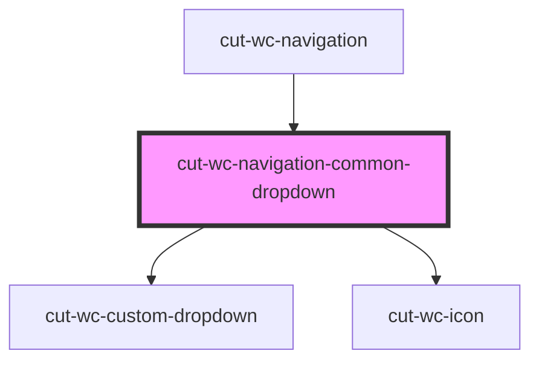

# cut-wc-common-dropdown

<!-- Auto Generated Below -->

## Properties

| Property   | Attribute  | Description | Type        | Default     |
| ---------- | ---------- | ----------- | ----------- | ----------- |
| `icon`     | `icon`     |             | `string`    | `'apps'`    |
| `menu`     | --         |             | `CbMapMenu` | `undefined` |
| `showicon` | `showicon` |             | `boolean`   | `true`      |
| `toplabel` | `toplabel` |             | `string`    | `''`        |

## Dependencies

### Used by

 - [cut-wc-navigation](..)

### Depends on

- [cut-wc-custom-dropdown](../../custom-dropdown)
- [cut-wc-icon](../../icon)

### Graph

----------------------------------------------

*Built with [StencilJS](https://stenciljs.com/)*
