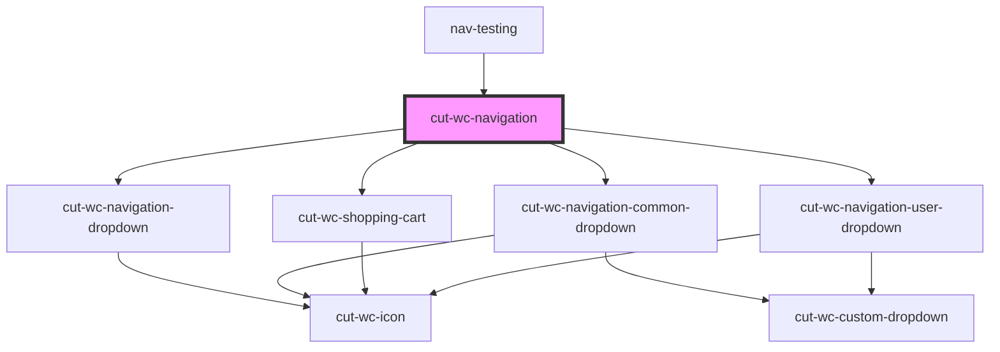

# cut-wc-navigation

<!-- Auto Generated Below -->

## Properties

| Property              | Attribute                | Description | Type                | Default          |
| --------------------- | ------------------------ | ----------- | ------------------- | ---------------- |
| `bentoMap`            | --                       |             | `CbMapMenu`         | `undefined`      |
| `betaHeaderImagePath` | `beta-header-image-path` |             | `string`            | `LOGO_PATH_BETA` |
| `hasLogoutEvent`      | `has-logout-event`       |             | `boolean`           | `undefined`      |
| `headerImagePath`     | `header-image-path`      |             | `string`            | `LOGO_PATH`      |
| `isBeta`              | `is-beta`                |             | `boolean`           | `undefined`      |
| `navigationMap`       | --                       |             | `CbMapMenu`         | `undefined`      |
| `noDropShadow`        | `no-drop-shadow`         |             | `boolean`           | `undefined`      |
| `shoppingCart`        | --                       |             | `ShoppingCartModel` | `undefined`      |
| `userMap`             | --                       |             | `CbMapMenu`         | `undefined`      |

## Dependencies

### Used by

 - [nav-testing](../../local-wrappers/nav-testing)

### Depends on

- [cut-wc-navigation-dropdown](navigation-dropdown)
- [cut-wc-navigation-common-dropdown](common-dropdown)
- [cut-wc-shopping-cart](../shopping-cart)
- [cut-wc-navigation-user-dropdown](user-dropdown)

### Graph

----------------------------------------------

*Built with [StencilJS](https://stenciljs.com/)*
