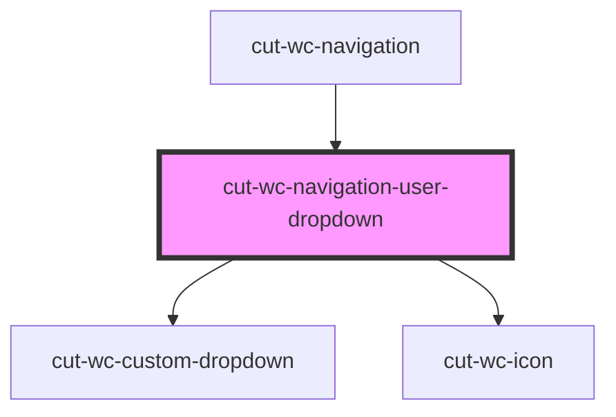

# cut-wc-user-dropdown

<!-- Auto Generated Below -->

## Properties

| Property         | Attribute          | Description | Type        | Default     |
| ---------------- | ------------------ | ----------- | ----------- | ----------- |
| `hasLogoutEvent` | `has-logout-event` |             | `boolean`   | `undefined` |
| `isBeta`         | `is-beta`          |             | `boolean`   | `undefined` |
| `userMap`        | --                 |             | `CbMapMenu` | `undefined` |

## Events

| Event     | Description | Type               |
| --------- | ----------- | ------------------ |
| `clicked` |             | `CustomEvent<any>` |

## Dependencies

### Used by

 - [cut-wc-navigation](..)

### Depends on

- [cut-wc-custom-dropdown](../../custom-dropdown)
- [cut-wc-icon](../../icon)

### Graph

----------------------------------------------

*Built with [StencilJS](https://stenciljs.com/)*
