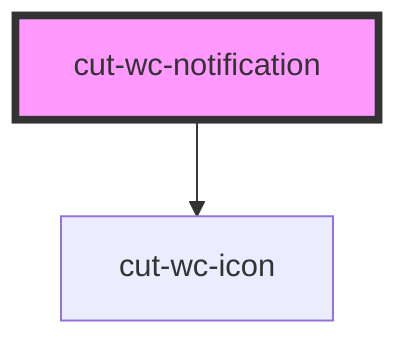

# cut-wc-notification

<!-- Auto Generated Below -->

## Properties

| Property  | Attribute | Description | Type      | Default |
| --------- | --------- | ----------- | --------- | ------- |
| `error`   | `error`   |             | `boolean` | `null`  |
| `info`    | `info`    |             | `boolean` | `null`  |
| `open`    | `open`    |             | `boolean` | `null`  |
| `success` | `success` |             | `boolean` | `null`  |
| `warn`    | `warn`    |             | `boolean` | `null`  |

## Events

| Event   | Description | Type                   |
| ------- | ----------- | ---------------------- |
| `close` |             | `CustomEvent<boolean>` |

## Methods

### `hide() => Promise<void>`

#### Returns

Type: `Promise<void>`

### `show() => Promise<void>`

#### Returns

Type: `Promise<void>`

## Dependencies

### Depends on

- [cut-wc-icon](../icon)

### Graph

----------------------------------------------

*Built with [StencilJS](https://stenciljs.com/)*
