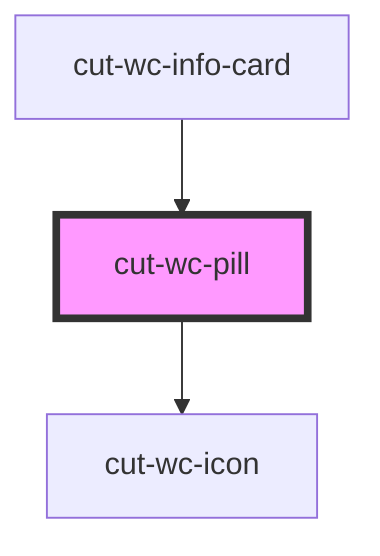

# cut-wc-pill

<!-- Auto Generated Below -->

## Properties

| Property      | Attribute     | Description | Type      | Default     |
| ------------- | ------------- | ----------- | --------- | ----------- |
| `disabled`    | `disabled`    |             | `boolean` | `undefined` |
| `gray`        | `gray`        |             | `boolean` | `undefined` |
| `icon`        | `icon`        |             | `boolean` | `undefined` |
| `iconName`    | `icon-name`   |             | `string`  | `"check"`   |
| `interactive` | `interactive` |             | `boolean` | `undefined` |
| `name`        | `name`        |             | `string`  | `undefined` |
| `primary`     | `primary`     |             | `boolean` | `undefined` |
| `selected`    | `selected`    |             | `boolean` | `undefined` |
| `value`       | `value`       |             | `string`  | `undefined` |

## Events

| Event     | Description | Type                   |
| --------- | ----------- | ---------------------- |
| `clicked` |             | `CustomEvent<boolean>` |

## Dependencies

### Used by

 - [cut-wc-info-card](../info-card)

### Depends on

- [cut-wc-icon](../icon)

### Graph

----------------------------------------------

*Built with [StencilJS](https://stenciljs.com/)*
