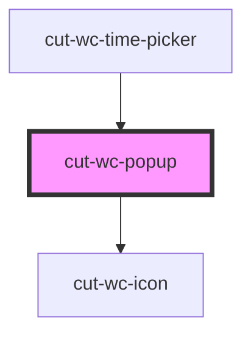

# cut-wc-popup

<!-- Auto Generated Below -->

## Properties

| Property   | Attribute  | Description | Type      | Default     |
| ---------- | ---------- | ----------- | --------- | ----------- |
| `left`     | `left`     |             | `string`  | `"center"`  |
| `noshadow` | `noshadow` |             | `boolean` | `false`     |
| `open`     | `open`     |             | `boolean` | `false`     |
| `top`      | `top`      |             | `string`  | `"center"`  |
| `width`    | `width`    |             | `string`  | `"auto"`    |
| `zindex`   | `zindex`   |             | `string`  | `undefined` |

## Dependencies

### Used by

 - [cut-wc-time-picker](../time-picker)

### Depends on

- [cut-wc-icon](../icon)

### Graph

----------------------------------------------

*Built with [StencilJS](https://stenciljs.com/)*
