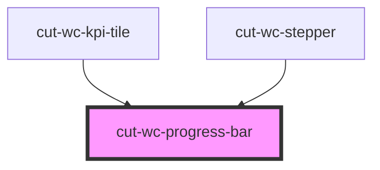

# cut-wc-progress-bar

<!-- Auto Generated Below -->

## Properties

| Property     | Attribute    | Description | Type      | Default     |
| ------------ | ------------ | ----------- | --------- | ----------- |
| `heading`    | `heading`    |             | `string`  | `undefined` |
| `onlyBar`    | `only-bar`   |             | `boolean` | `false`     |
| `percentage` | `percentage` |             | `string`  | `undefined` |
| `primary`    | `primary`    |             | `boolean` | `undefined` |
| `warn`       | `warn`       |             | `boolean` | `undefined` |

## Dependencies

### Used by

 - [cut-wc-kpi-tile](../kpi-tile)
 - [cut-wc-stepper](../stepper)

### Graph

----------------------------------------------

*Built with [StencilJS](https://stenciljs.com/)*
