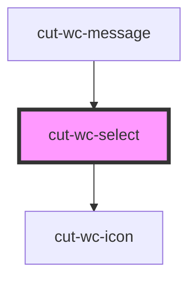

# cut-wc-select

<!-- Auto Generated Below -->

## Properties

| Property       | Attribute       | Description | Type                        | Default                 |
| -------------- | --------------- | ----------- | --------------------------- | ----------------------- |
| `disabled`     | `disabled`      |             | `boolean`                   | `undefined`             |
| `displayValue` | `display-value` |             | `string`                    | `undefined`             |
| `dropDownData` | --              |             | `SelectDropDownDataModal[]` | `undefined`             |
| `error`        | `error`         |             | `boolean`                   | `undefined`             |
| `guideline`    | `guideline`     |             | `string`                    | `undefined`             |
| `icon`         | `icon`          |             | `string`                    | `"keyboard_arrow_down"` |
| `label`        | `label`         |             | `string`                    | `undefined`             |
| `multiple`     | `multiple`      |             | `boolean`                   | `undefined`             |
| `name`         | `name`          |             | `string`                    | `undefined`             |
| `require`      | `require`       |             | `boolean`                   | `undefined`             |
| `success`      | `success`       |             | `boolean`                   | `undefined`             |

## Events

| Event          | Description | Type                      |
| -------------- | ----------- | ------------------------- |
| `selectChange` |             | `CustomEvent<Fieldprops>` |

## Dependencies

### Used by

 - [cut-wc-message](../message)

### Depends on

- [cut-wc-icon](../icon)

### Graph

----------------------------------------------

*Built with [StencilJS](https://stenciljs.com/)*
