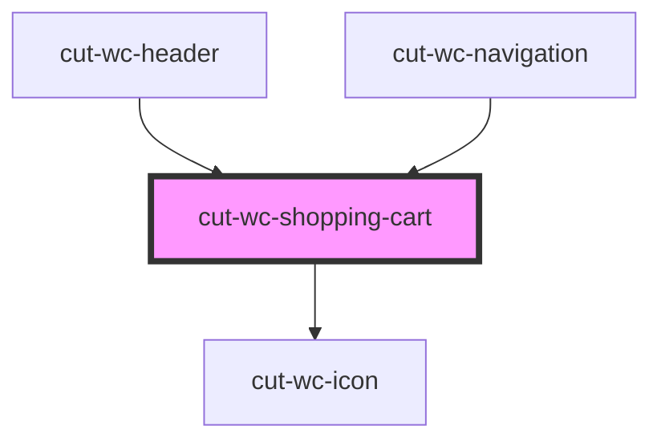

# cut-wc-shopping-cart

<!-- Auto Generated Below -->

## Properties

| Property       | Attribute | Description | Type                | Default     |
| -------------- | --------- | ----------- | ------------------- | ----------- |
| `shoppingCart` | --        |             | `ShoppingCartModel` | `undefined` |

## Events

| Event     | Description | Type                             |
| --------- | ----------- | -------------------------------- |
| `clicked` |             | `CustomEvent<ShoppingCartModel>` |

## Dependencies

### Used by

 - [cut-wc-header](../header)
 - [cut-wc-navigation](../navigation)

### Depends on

- [cut-wc-icon](../icon)

### Graph

----------------------------------------------

*Built with [StencilJS](https://stenciljs.com/)*
