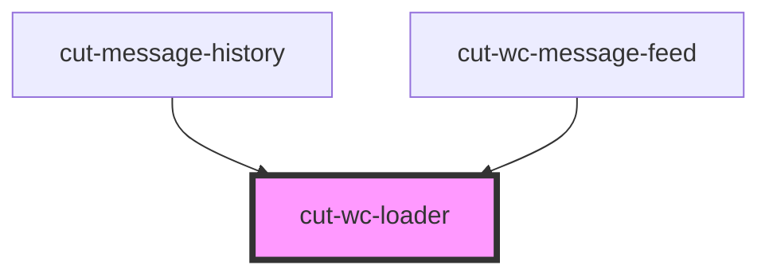

# cut-wc-loader

<!-- Auto Generated Below -->

## Properties

| Property         | Attribute | Description | Type                    | Default |
| ---------------- | --------- | ----------- | ----------------------- | ------- |
| `classes`        | --        |             | `string[]`              | `[]`    |
| `count`          | `count`   |             | `number`                | `1`     |
| `styleOverrides` | --        |             | `{ [k: string]: any; }` | `{}`    |

## Dependencies

### Used by

 - [cut-message-history](../messenger/message-center/history)
 - [cut-wc-message-feed](../messenger/message-feed)

### Graph

----------------------------------------------

*Built with [StencilJS](https://stenciljs.com/)*
