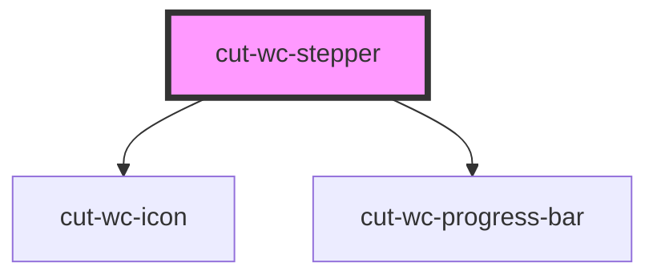

# cut-wc-stepper

<!-- Auto Generated Below -->

## Properties

| Property    | Attribute    | Description | Type      | Default     |
| ----------- | ------------ | ----------- | --------- | ----------- |
| `emitEvent` | `emit-event` |             | `boolean` | `false`     |
| `nonLinear` | `non-linear` |             | `boolean` | `false`     |
| `steps`     | --           |             | `Step[]`  | `undefined` |
| `vertical`  | `vertical`   |             | `boolean` | `undefined` |

## Events

| Event     | Description | Type                |
| --------- | ----------- | ------------------- |
| `clicked` |             | `CustomEvent<Step>` |

## Dependencies

### Depends on

- [cut-wc-icon](../icon)
- [cut-wc-progress-bar](../progress-bar)

### Graph

----------------------------------------------

*Built with [StencilJS](https://stenciljs.com/)*
