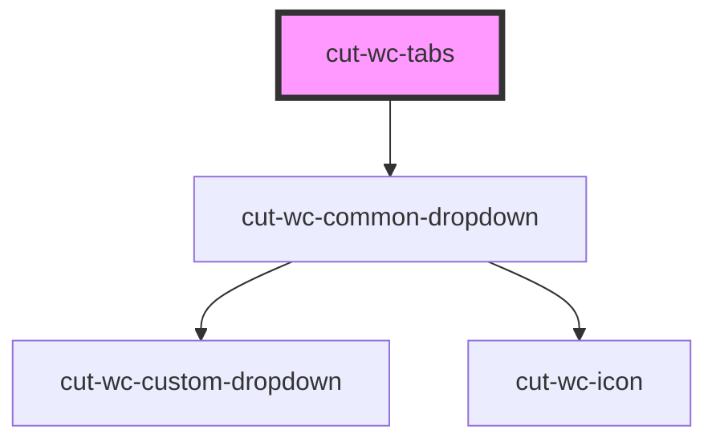

# cut-wc-tab-group

<!-- Auto Generated Below -->

## Properties

| Property      | Attribute      | Description | Type     | Default     |
| ------------- | -------------- | ----------- | -------- | ----------- |
| `maxTab`      | `max-tab`      |             | `string` | `"4"`       |
| `selected`    | `selected`     |             | `string` | `undefined` |
| `selectedTab` | `selected-tab` |             | `string` | `undefined` |

## Events

| Event     | Description | Type               |
| --------- | ----------- | ------------------ |
| `clicked` |             | `CustomEvent<any>` |

## Dependencies

### Depends on

- [cut-wc-common-dropdown](../common-dropdown)

### Graph

----------------------------------------------

*Built with [StencilJS](https://stenciljs.com/)*
