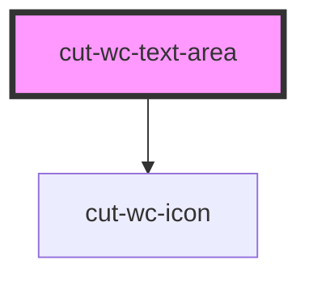

# cut-wc-text-area

<!-- Auto Generated Below -->

## Properties

| Property    | Attribute    | Description | Type      | Default     |
| ----------- | ------------ | ----------- | --------- | ----------- |
| `disabled`  | `disabled`   |             | `boolean` | `false`     |
| `error`     | `error`      |             | `boolean` | `undefined` |
| `guideline` | `guideline`  |             | `string`  | `undefined` |
| `label`     | `label`      |             | `string`  | `undefined` |
| `maxLength` | `max-length` |             | `string`  | `"5000"`    |
| `name`      | `name`       |             | `string`  | `undefined` |
| `require`   | `require`    |             | `boolean` | `undefined` |
| `success`   | `success`    |             | `boolean` | `undefined` |
| `value`     | `value`      |             | `string`  | `undefined` |

## Events

| Event           | Description | Type                      |
| --------------- | ----------- | ------------------------- |
| `inputUpdate`   |             | `CustomEvent<Fieldprops>` |
| `keyDownChange` |             | `CustomEvent<Fieldprops>` |
| `keyUpChange`   |             | `CustomEvent<Fieldprops>` |

## Dependencies

### Depends on

- [cut-wc-icon](../icon)

### Graph

----------------------------------------------

*Built with [StencilJS](https://stenciljs.com/)*
