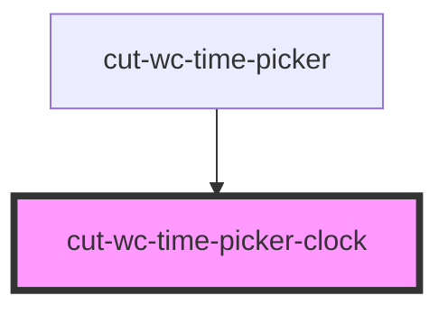

# cut-wc-time-picker

<!-- Auto Generated Below -->

## Properties

| Property          | Attribute           | Description | Type                   | Default     |
| ----------------- | ------------------- | ----------- | ---------------------- | ----------- |
| `ampm`            | `ampm`              |             | `string`               | `eAmpm.AM`  |
| `currentTimePart` | `current-time-part` |             | `"hours" \| "minutes"` | `"hours"`   |
| `open`            | `open`              |             | `string`               | `undefined` |
| `time`            | `time`              |             | `string`               | `undefined` |

## Dependencies

### Used by

 - [cut-wc-time-picker](../time-picker)

### Graph

----------------------------------------------

*Built with [StencilJS](https://stenciljs.com/)*
