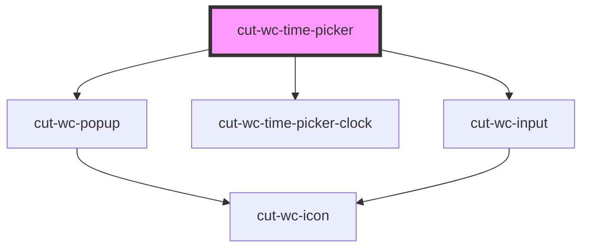

# cut-wc-time-picker

<!-- Auto Generated Below -->

## Properties

| Property        | Attribute       | Description | Type      | Default     |
| --------------- | --------------- | ----------- | --------- | ----------- |
| `guideline`     | `guideline`     |             | `string`  | `""`        |
| `open`          | `open`          |             | `boolean` | `undefined` |
| `popupleft`     | `popupleft`     |             | `string`  | `"center"`  |
| `popupnoshadow` | `popupnoshadow` |             | `boolean` | `undefined` |
| `popuptop`      | `popuptop`      |             | `string`  | `"center"`  |
| `popupwidth`    | `popupwidth`    |             | `string`  | `"350px"`   |
| `popupzindex`   | `popupzindex`   |             | `string`  | `""`        |
| `time`          | `time`          |             | `string`  | `undefined` |

## Events

| Event         | Description | Type                  |
| ------------- | ----------- | --------------------- |
| `timeChanged` |             | `CustomEvent<string>` |

## Dependencies

### Depends on

- [cut-wc-popup](../popup)
- [cut-wc-time-picker-clock](../time-picker-clock)
- [cut-wc-input](../input)

### Graph

----------------------------------------------

*Built with [StencilJS](https://stenciljs.com/)*
