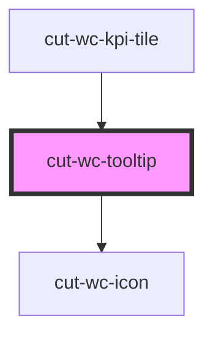

# cut-wc-tooltip

<!-- Auto Generated Below -->

## Properties

| Property | Attribute | Description | Type      | Default     |
| -------- | --------- | ----------- | --------- | ----------- |
| `bottom` | `bottom`  |             | `boolean` | `undefined` |
| `icon`   | `icon`    |             | `string`  | `undefined` |
| `left`   | `left`    |             | `boolean` | `undefined` |
| `right`  | `right`   |             | `boolean` | `undefined` |
| `top`    | `top`     |             | `boolean` | `undefined` |

## Dependencies

### Used by

 - [cut-wc-kpi-tile](../kpi-tile)

### Depends on

- [cut-wc-icon](../icon)

### Graph

----------------------------------------------

*Built with [StencilJS](https://stenciljs.com/)*
